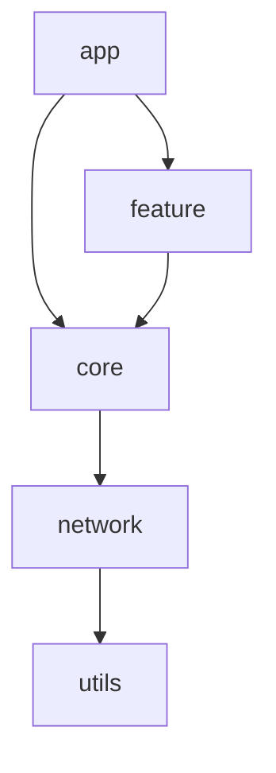

# ModuleGraph - Android 모듈 의존성 시각화 도구

## 1. 프로젝트 개요
ModuleGraph는 Android 프로젝트의 모듈 구조를 분석하고 시각화하는 도구입니다. Multi Module 프로젝트에서 모듈 간의 의존성 관계를 Mermaid 그래프로 표현하여 개발자가 프로젝트 구조를 쉽게 파악할 수 있도록 도와줍니다.

## 2. 주요 기능

### 2.1 모듈 구조 분석
- settings.gradle(.kts) 파일 분석을 통한 프로젝트 모듈 목록 추출
- 각 모듈의 build.gradle(.kts) 파일 분석을 통한 의존성 관계 파악
- 모듈 간 직접/간접 의존성 관계 매핑

### 2.2 시각화
- Mermaid를 사용한 모듈 의존성 그래프 시각화
- HTML 파일로 결과 출력
- 모듈 간 의존성 관계를 방향성 그래프로 표현
- 모듈별 상세 정보 표시

## 3. 기술 스택

### 3.1 분석 도구
- Python 3.x
- Gradle 파일 파싱을 위한 정규표현식 또는 파서 라이브러리
- HTML 템플릿 엔진 (Jinja2)

### 3.2 시각화
- Mermaid.js
- HTML/CSS
- JavaScript (기본 인터랙션)

## 4. 구현 계획

### Phase 1: 프로젝트 초기 설정 (3일)
- Python 프로젝트 구조 설정
- 필요한 패키지 의존성 설정
- 기본 HTML 템플릿 작성

### Phase 2: Gradle 파일 분석기 구현 (4일)
- settings.gradle(.kts) 파일 파싱 로직 구현
- build.gradle(.kts) 파일 파싱 로직 구현
- 모듈 의존성 분석 로직 구현
- 테스트 케이스 작성

### Phase 3: 시각화 구현 (3일)
- Mermaid 그래프 생성 로직 구현
- HTML 템플릿 구현
- 기본 인터랙션 기능 구현

### Phase 4: 테스트 및 최적화 (2일)
- 다양한 Android 프로젝트에 대한 테스트
- 성능 최적화
- 버그 수정

## 5. 프로젝트 구조
```
ModuleGraph/
├── src/
│   ├── analyzer/
│   │   ├── __init__.py
│   │   ├── gradle_parser.py
│   │   └── dependency_analyzer.py
│   ├── visualizer/
│   │   ├── __init__.py
│   │   ├── mermaid_generator.py
│   │   └── html_generator.py
│   └── main.py
├── templates/
│   └── report.html
├── tests/
│   └── test_analyzer.py
├── requirements.txt
└── README.md
```

## 6. 사용 방법
1. Python 스크립트 실행
```bash
python src/main.py --project-path /path/to/android/project
```

2. 생성된 HTML 파일을 웹 브라우저에서 열어 결과 확인

## 7. 출력 예시


## 8. 향후 확장 가능성
- 모듈 의존성 순환 참조 감지
- 모듈 크기 및 복잡도 분석
- 의존성 최적화 제안
- 커맨드 라인 인터페이스 개선
- 다양한 그래프 스타일 옵션 추가

## 9. 성공 지표
- 정확한 모듈 의존성 분석 (정확도 95% 이상)
- 대규모 프로젝트(100+ 모듈) 처리 가능
- 직관적인 시각화 결과
- 빠른 분석 속도 (5초 이내) 