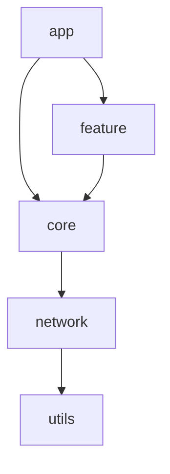

# ModuleGraph

Android 프로젝트의 모듈 의존성을 분석하고 시각화하는 도구입니다. Multi Module 프로젝트에서 모듈 간의 의존성 관계를 Mermaid 그래프로 표현하여 개발자가 프로젝트 구조를 쉽게 파악할 수 있도록 도와줍니다.

## 주요 기능

- Android 프로젝트의 모듈 구조 분석
  - settings.gradle(.kts) 파일 분석을 통한 프로젝트 모듈 목록 추출
  - build.gradle(.kts) 파일 분석을 통한 의존성 관계 파악
  - 모듈 간 직접/간접 의존성 관계 매핑
- 모듈 의존성 시각화
  - Mermaid.js를 사용한 인터랙티브 그래프
  - 드래그 앤 드롭으로 그래프 이동
  - 마우스 휠 또는 컨트롤 버튼으로 확대/축소
  - 노드 클릭으로 모듈 선택 및 강조
- HTML 리포트 생성
  - 반응형 디자인
  - 직관적인 사용자 인터페이스
  - 모듈 의존성 관계를 방향성 그래프로 표현

## 설치 방법

1. Python 3.8 이상이 필요합니다.
2. 필요한 패키지를 설치합니다:

```bash
pip install -r requirements.txt
```

## 사용 방법

1. Android 프로젝트의 루트 디렉토리에서 다음 명령을 실행합니다:

```bash
python src/main.py --project-path /path/to/android/project [--output output.html]
```

옵션:
- `--project-path`: Android 프로젝트의 루트 디렉토리 경로 (필수)
- `--output`: 생성될 HTML 파일의 경로 (기본값: module_graph.html)

2. 생성된 HTML 파일을 웹 브라우저에서 열어 결과를 확인합니다.

## 그래프 조작 방법

생성된 그래프는 다음과 같은 방법으로 조작할 수 있습니다:

1. 그래프 이동
   - 마우스로 드래그하여 그래프 이동
   - 드래그 중일 때 커서가 'grabbing'으로 변경되어 시각적 피드백 제공

2. 확대/축소
   - 마우스 휠을 사용하여 확대/축소
   - 우측 하단의 컨트롤 버튼 사용 (+/-/Reset)
   - 최소 0.5배, 최대 2배까지 확대/축소 가능

3. 모듈 선택
   - 모듈 노드를 클릭하여 선택
   - 선택된 모듈은 파란색 테두리로 강조
   - 호버 시 밝기 변화로 시각적 피드백 제공

## 예시

다음과 같은 모듈 구조를 가진 Android 프로젝트가 있다고 가정합니다:

```
:app
:core
:feature
:network
:utils
```

실행 결과는 다음과 같은 Mermaid 그래프로 시각화됩니다:



## 프로젝트 구조

```
ModuleGraph/
├── src/
│   ├── analyzer/
│   │   ├── __init__.py
│   │   ├── gradle_parser.py      # Gradle 파일 파싱
│   │   └── dependency_analyzer.py # 의존성 분석
│   ├── visualizer/
│   │   ├── __init__.py
│   │   ├── mermaid_generator.py  # Mermaid 그래프 생성
│   │   └── html_generator.py     # HTML 리포트 생성
│   └── main.py                   # 메인 실행 파일
├── templates/
│   └── report.html              # HTML 리포트 템플릿
├── tests/
│   └── test_analyzer.py         # 테스트 코드
├── requirements.txt             # 의존성 패키지 목록
└── README.md                    # 프로젝트 문서
```

## 개발

### 테스트

```bash
pytest tests/
```

### 기술 스택

- Python 3.8+
- Mermaid.js 10.6.1
- D3.js 7.8.5
- Jinja2 (템플릿 엔진)

## 라이선스

MIT License
