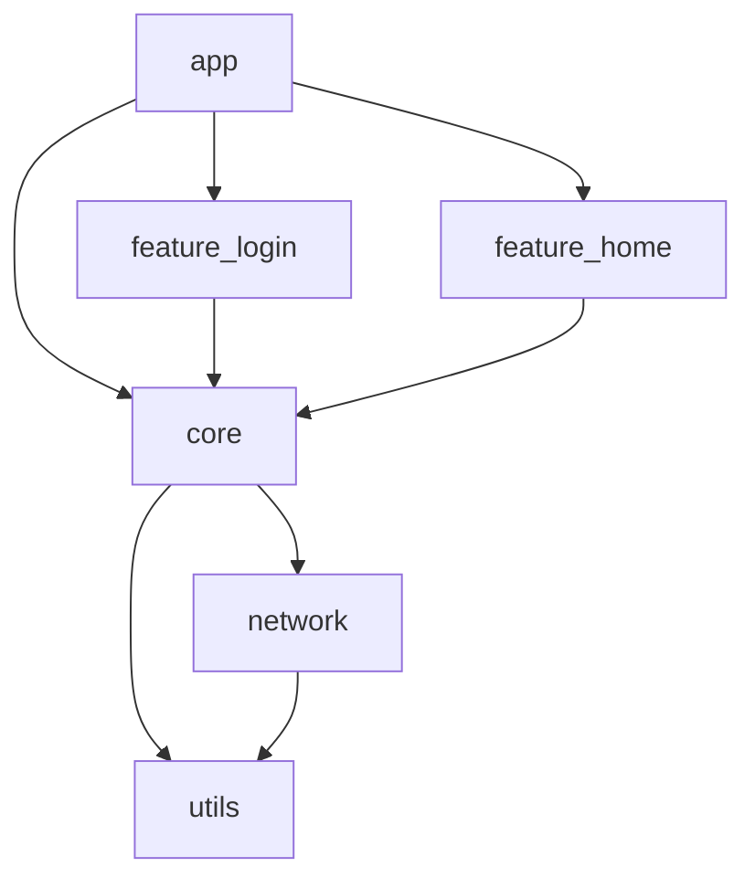

# ModuleGraph

Android 프로젝트의 모듈 의존성을 분석하고 시각화하는 도구입니다.

## 기능

- Android 프로젝트의 모듈 구조 분석
- 모듈 간 의존성 관계 시각화
- Mermaid.js를 사용한 인터랙티브 그래프
- 순환 의존성 감지

## 설치 방법

1. Python 3.8 이상이 필요합니다.
2. 필요한 패키지를 설치합니다:

```bash
pip install -r requirements.txt
```

## 사용 방법

1. Android 프로젝트의 루트 디렉토리에서 다음 명령을 실행합니다:

```bash
python src/main.py --project-path /path/to/android/project
```

2. 생성된 `module_graph.html` 파일을 웹 브라우저에서 열어 결과를 확인합니다.

## 예시

다음과 같은 모듈 구조를 가진 Android 프로젝트가 있다고 가정합니다:

```
:app
:core
:feature:login
:feature:home
:network
:utils
```

실행 결과는 다음과 같은 Mermaid 그래프로 시각화됩니다:



## 개발

### 프로젝트 구조

```
ModuleGraph/
├── src/
│   ├── analyzer/
│   │   ├── __init__.py
│   │   ├── gradle_parser.py
│   │   └── dependency_analyzer.py
│   ├── visualizer/
│   │   ├── __init__.py
│   │   ├── mermaid_generator.py
│   │   └── html_generator.py
│   └── main.py
├── templates/
│   └── report.html
├── tests/
│   └── test_analyzer.py
├── requirements.txt
└── README.md
```

### 테스트

```bash
pytest tests/
```

## 라이선스

MIT License # ModuleGraph
